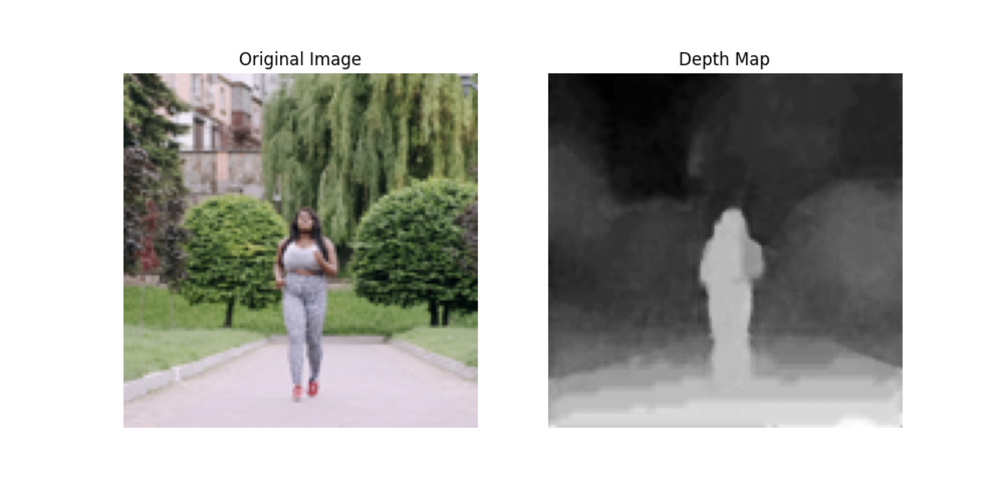
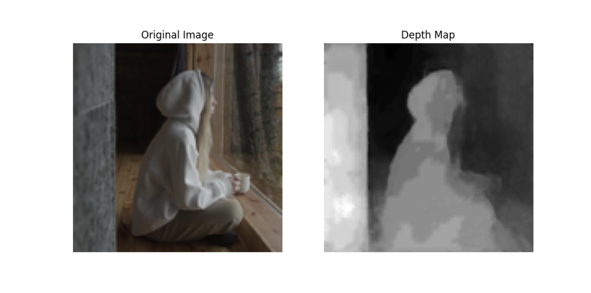
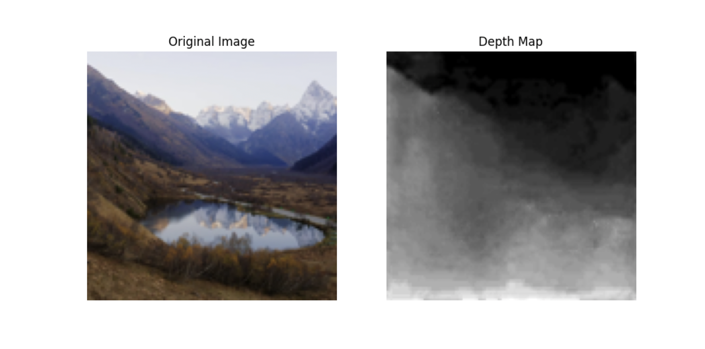

# Depth Sensing 128x128 TFLite Model

This is an 8-bit integer quantized TensorFlow Lite (TFLite) model that takes an 8-bit RGB image as input and generates a 128x128 8-bit depth map. The model follows a UNet architecture and was trained as a student model of MiDaS. After quantization, the model underwent Quantization Aware Training (QAT) to recover performance losses due to quantization.

 
 
 

## Features
- Fully quantized from input to output.
- Super-fast inference: only 7ms on a Samsung Galaxy S21 using XNN Pack.
- Takes a 128x128x3 RGB 8-bit image and generates a 128x128 8-bit depth map.
- Capable of generating high-resolution depth maps through guided filtering.

## Testing

### Prerequisites
- Python 3.9 or later.
- Python packages: TensorFlow, Pillow, NumPy, Matplotlib

### Test
1. Clone the repository from GitHub.
2. Open a terminal and run:
     python ./try_out.py
   This command uses ./out00001.png as input to model test.tflite and creates a depth map.
3. You can edit try_out.py to try different images.  

## Usage
This is a TensorFlow 1.x TFLite model (test.tflite), compatible with a wide range of devices, including older mobile devices. Due to its high optimization, it can easily achieve frame rates of up to 120fps.  

## Contributing
Pull requests are welcome. For major changes, please open an issue first to discuss what you would like to change.

## License
This project is licensed under the MIT License. See the [LICENSE](LICENSE) file for details.

## Acknowledgments
- MiDaS Model (https://github.com/isl-org/MiDaS) for serving as the teacher model in knowledge distillation training.

